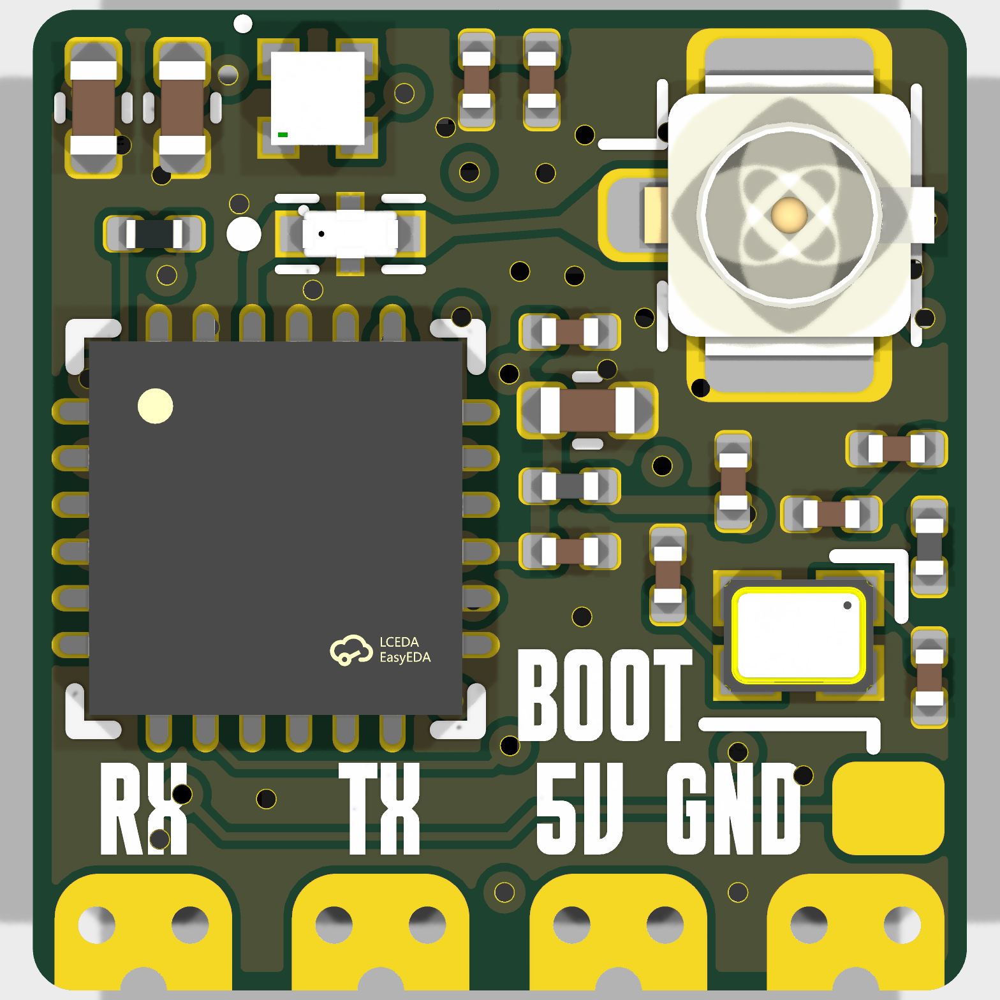
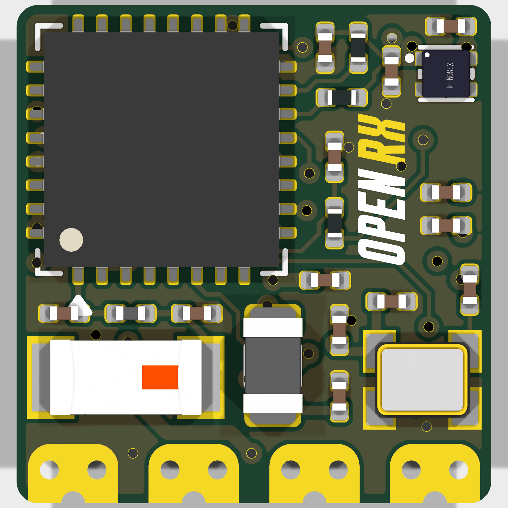

# OpenRX-Lite-UFL

ESP32-C3 + SX1281, 2.4 GHz only, U.FL antenna connector. Same circuit as the Lite, different antenna interface.

## Board preview

| Front | Back |
|-------|------|
|  |  |

## Schematic

- Main sheet: `esp32c3_sx1281_lite.kicad_sch`
- RF chain: `SX1281 (U3) RFIO -> 2450FM07D0034T (FL1) -> U.FL-R-SMT-1(80) (J1)`
- AE1 (2450AT18A100E) is the ESP32-C3 Wi-Fi antenna, not the ELRS link antenna
- No RF front-end (PA/LNA), no RF switch, no sub-GHz
- 2450FM07D0034T output is 50 ohm, U.FL is 50 ohm: clean match

### GPIO map

Same as the Lite: see [../OpenRX-Lite/DESIGN.md](../OpenRX-Lite/DESIGN.md).

### No boot button

Same as the Lite: GPIO 9 pull-up only, no physical switch.

## Firmware

- ELRS target: `Unified_ESP32C3_2400_RX` (same as the Lite)
- Hardware JSON: `/shared/elrs-targets/OpenRX Lite-UFL 2400.json`

## Flash interface

- Pads: `5V`, `GND`, `RX`, `TX`
- `BOOT` pad (TP5): short to GND during power-up to enter UART download mode
- Wi-Fi OTA after first flash. Full procedures: [../FLASHING.md](../FLASHING.md)

## Sourcing

- All parts LCSC basic/preferred where possible
- `C2651081` 2450FM07D0034T: 2.4 GHz band-pass filter
- `C2151551` SX1281IMLTRT: watch stock for volume runs
- `C88374` U.FL-R-SMT-1(80): antenna connector
